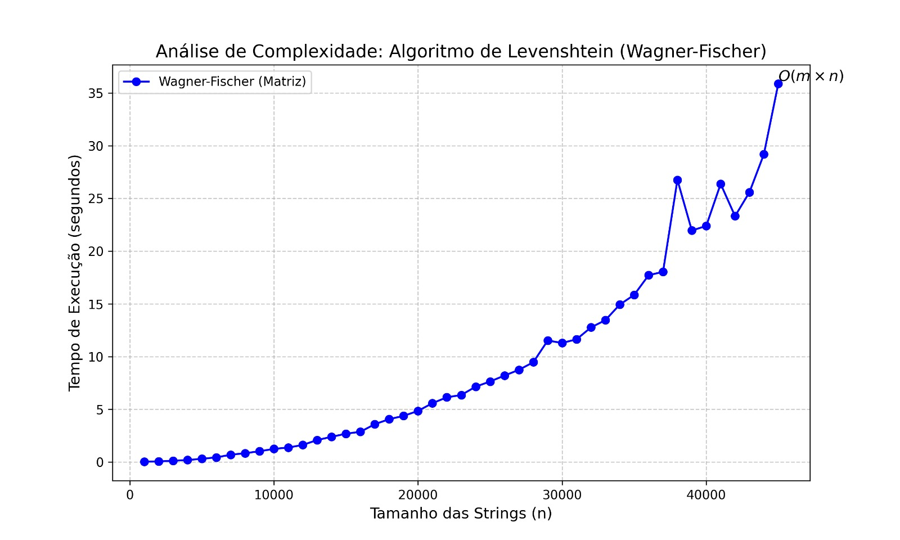

# Análise de Complexidade: Algoritmo de Levenshtein (Wagner-Fischer)

Este repositório contém uma implementação em C do algoritmo de Wagner-Fischer para calcular a Distância de Levenshtein, juntamente com scripts de automação para análise de desempenho (benchmark) e visualização de dados.

## Estrutura do Repositório

```plaintext
levenshtein_benchmark/
├── codigos/
│   └── benchmark_levenshtein.c  <-- Código + lógica de teste
├── graficos/       
│   ├── gerar_grafico.py         <-- Script Python
|   └── grafico_desempenho.jpg   <-- Exemplo de gráfico de execução 
├── dados/
├── Makefile
└── README.md
```

## Pré-requisitos

Para rodar este projeto, é necessário:

- **GCC** (GNU Compiler Collection)
- **Make** (Build automation tool)
- **Python 3** com as seguintes bibliotecas:
  - `pandas`
  - `matplotlib`

Você pode instalar as dependências Python com:
```bash
pip install pandas matplotlib
```

## Como Executar
Na raiz do projeto, execute:

```bash
make
```

Isso irá:

1. Compilar o código C.
2. Executar o binário (que testará strings de tamanho 100 até 2000).
3. Salvar os tempos em `dados/resultados.csv`.
4. Gerar o gráfico de desempenho em `graficos/grafico_desempenho.png`.

## Resultados Esperados

O algoritmo de Wagner-Fischer possui complexidade de tempo O(m x n) sendo m e n as duas strings a serem comparadas. Caso as strings tenham o mesmo tamanho, a complexidade se torna O(n²).

Ao executar o `make`, um gráfico será gerado mostrando a curva de tempo de execução em função do tamanho das strings. A curva resultante deve se assemelhar a uma parábola, confirmando a complexidade teórica.

## Exemplo de Execução e Avaliação Empírica

Para validar a análise teórica, foram realizados testes com strings aleatórias de tamanhos variando entre 1000 e 45000 caracteres.

**Ambiente de teste:**

* **Processador:** Intel Core i5
* **Sistema Operacional:** Windows
* **Compilador:** GCC 

### Resultados Obtidos

| Tamanho da Entrada (N) | Tempo Médio (s) | Crescimento Observado |
| --- | --- | --- |
| 5000 | 0.3026 | - |
| 10000 | 1.2380 | ~ 4.1x |
| 20000 | 4.8437 | ~ 3.9x |
| 40000 | 22.3925 | ~ 4.6x |

### Análise de Desempenho

A imagem abaixo ilustra a curva de crescimento obtida:



Observa-se que, ao dobrar o tamanho da entrada (ex: de 5000 para 10000), o tempo de execução aumenta aproximadamente 4 vezes. Embora existam variações naturais decorrentes do ambiente de execução, a tendência média confirma experimentalmente a natureza quadrática ($O(n²)$) do algoritmo, visto que $(2N)²$ = $4N²$.

---

*Desenvolvido para fins de estudo de Algoritmos e Complexidade.*
